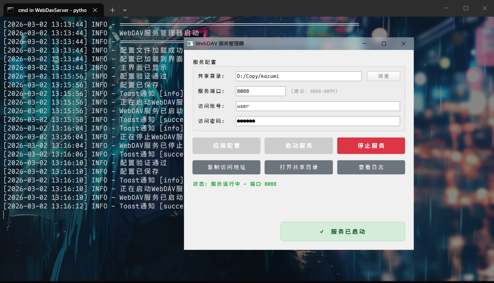

# WebDAV 服务管理器

一个基于 Python + PySide6 的轻量级 WebDAV 服务管理工具，提供可视化配置界面，支持跨平台运行。



## 功能特性

- ✅ **纯可视化操作** - 无需命令行配置，所有功能通过图形界面完成
- ✅ **配置验证** - 严格的配置验证机制，无效配置禁止启动
- ✅ **Toast通知** - Windows风格的通知提示系统
- ✅ **跨平台支持** - 支持 Windows、Linux、macOS
- ✅ **安全认证** - 支持用户名密码访问控制
- ✅ **日志记录** - 完整的操作和错误日志
- ✅ **客户端兼容** - 支持多种客户端访问（Android、Windows、Linux）

## 系统要求

- Python 3.7 或更高版本
- 支持的操作系统：Windows 10+、Linux、macOS
- 至少 100MB 可用磁盘空间

## 安装步骤

### 1. 克隆或下载项目

```bash
# 创建项目目录
mkdir webdav_manager
cd webdav_manager
```

### 2. 安装依赖

```bash
pip install -r requirements.txt
```

或手动安装：

```bash
pip install PySide6 wsgidav cheroot
```

### 3. 运行程序

```bash
python main.py
```

## 使用指南

### 首次使用

1. **启动程序**
   
   - 运行 `python main.py`
   - 程序会自动创建 `./data` 目录用于存储配置和日志

2. **配置服务**
   
   - **共享目录**：点击"浏览"按钮选择要共享的文件夹
   - **服务端口**：设置服务端口（建议 8088-8099，范围 1025-65535）
   - **访问账号**：设置登录用户名
   - **访问密码**：设置登录密码

3. **应用配置**
   
   - 点击"应用配置"按钮
   - 程序会自动验证配置有效性
   - 配置通过后会保存到 `./data/config.json`

4. **启动服务**
   
   - 点击"启动服务"按钮
   - 等待提示"服务已启动"
   - 服务启动后，界面会显示运行状态

5. **获取访问地址**
   
   - 点击"复制访问地址"按钮
   - 访问地址格式：`http://[您的IP]:[端口]/`

### 客户端连接

#### Android 客户端

推荐使用以下应用：

- **ES文件浏览器**
- **Solid Explorer**
- **FX文件管理器**

连接步骤：

1. 打开应用的网络功能
2. 添加 WebDAV 连接
3. 输入服务器地址、用户名、密码
4. 连接成功后即可访问文件

#### Windows 客户端

**方法1：映射网络驱动器**

1. 打开"此电脑"
2. 点击"映射网络驱动器"
3. 输入地址：`http://[服务器IP]:[端口]/`
4. 输入用户名和密码
5. 完成映射

**方法2：资源管理器直接访问**

1. 在地址栏输入：`\\[服务器IP]@[端口]\DavWWWRoot`
2. 输入用户名和密码

#### Linux 客户端

**方法1：使用 davfs2**

```bash
sudo apt-get install davfs2
sudo mount -t davfs http://[服务器IP]:[端口]/ /mnt/webdav
```

**方法2：使用文件管理器**

- Nautilus (GNOME)：文件 → 连接到服务器
- Dolphin (KDE)：网络 → 添加网络文件夹

### 获取本机IP地址

#### Windows

```cmd
ipconfig
```

查找 IPv4 地址

#### Linux/macOS

```bash
ip addr
# 或
ifconfig
```

## 配置文件

配置文件位置：`./data/config.json`

```json
{
    "share_dir": "/path/to/share",
    "port": 8088,
    "username": "admin",
    "password": "password",
    "last_update": "2024-01-01 12:00:00"
}
```

## 日志文件

日志文件位置：`./data/webdav.log`

日志内容包括：

- 程序启动和停止
- 配置变更
- 服务启停
- 错误和警告信息

可通过界面的"查看日志"按钮打开日志文件。

## 目录结构

```
webdav_manager/
├── main.py                    # 主程序入口
└── manager/  
    ├── ui_manager.py             # UI界面管理
    ├── config_manager.py         # 配置管理
    ├── service_manager.py        # 服务管理
    ├── notification_manager.py   # 通知管理
├── requirements.txt          # 依赖包列表
├── README.md                 # 说明文档
└── data/                     # 数据目录（自动创建）
    ├── config.json          # 配置文件
    └── webdav.log           # 运行日志
```

## 常见问题

### Q1: 端口被占用怎么办？

**A:** 修改配置中的端口号，避免使用 80、443、8080 等常用端口。建议使用 8088-8099 范围内的端口。

### Q2: 客户端连接失败？

**A:** 

- 检查防火墙设置，确保端口已放行
- 确认客户端与服务器在同一网络
- 验证IP地址和端口是否正确
- 检查用户名和密码是否正确

### Q3: 目录无法写入？

**A:** 检查共享目录的读写权限，确保程序有访问权限。Windows 上可能需要以管理员身份运行。

### Q4: 如何查看运行日志？

**A:** 点击界面中的"查看日志"按钮，或直接打开 `./data/webdav.log` 文件。

### Q5: 支持外网访问吗？

**A:** 本工具设计用于内网环境。如需外网访问，需要：

- 配置路由器端口映射
- 设置防火墙规则
- 考虑安全性（建议使用VPN）

### Q6: 低端口（1024以下）无法使用？

**A:** 

- Windows：需要管理员权限
- Linux：需要 root 权限或使用 1025 以上端口

### Q7: 配置文件损坏怎么办？

**A:** 程序会自动检测并重置为默认配置，重新设置即可。

## 性能优化建议

1. **共享大量文件时**
   
   - 建议使用 SSD 硬盘
   - 合理组织目录结构
   - 避免过深的目录层级

2. **多客户端并发访问**
   
   - 确保服务器有足够的带宽
   - 监控系统资源使用情况

3. **长时间运行**
   
   - 定期检查日志文件大小
   - 必要时清理日志文件

## 安全建议

1. **设置强密码**
   
   - 使用复杂的用户名和密码
   - 定期更换密码

2. **内网使用**
   
   - 仅在可信网络环境使用
   - 避免直接暴露到公网

3. **权限控制**
   
   - 只共享必要的目录
   - 定期检查共享目录内容

4. **防火墙配置**
   
   - 只允许信任的IP访问
   - 限制端口访问范围

## 打包发布

使用 PyInstaller 打包成独立可执行文件：

### Windows

```bash
pip install pyinstaller
pyinstaller --onefile --windowed --name WebDAV-Manager main.py
```

### Linux

```bash
pip install pyinstaller
pyinstaller --onefile --name webdav-manager main.py
```

生成的可执行文件在 `dist` 目录中。

## 技术支持

如遇到问题，请：

1. 查看日志文件 `./data/webdav.log`
2. 检查配置文件 `./data/config.json`
3. 参考本文档的常见问题部分

## 更新日志

### v1.0.0 (2024-12-30)

- 首次发布
- 实现基本的WebDAV服务功能
- 提供可视化配置界面
- 支持跨平台运行
- Toast通知系统
- 完整的日志记录

## 许可证

本项目仅供学习和个人使用。

[CC BY-NC 4.0](https://creativecommons.org/licenses/by-nc/4.0/)

## 致谢

- [WsgiDAV](https://github.com/mar10/wsgidav) - WebDAV服务实现
- [PySide6](https://wiki.qt.io/Qt_for_Python) - Qt界面框架
- [Cheroot](https://github.com/cherrypy/cheroot) - WSGI服务器

---

**享受您的文件共享体验！** 🚀